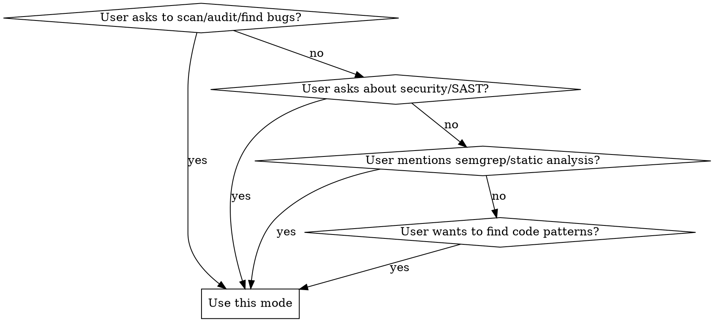

# Semgrep — Fast Pattern Scanning

## Overview

Semgrep is a fast, open-source static analysis tool — semantic grep for code. It finds bugs, security vulnerabilities, and enforces coding standards across 30+ languages. Rules look like the code you already write; no AST wrestling or regex DSLs.

**适配版本：** Semgrep 1.0+（使用 `semgrep scan` 新 CLI 语法）。

**Announce at start:** "I'm using the Code Audit skill — fast scan mode."

## When to Use



**Use when:**
- User asks to "scan my code", "find bugs", "audit security", "check for vulnerabilities"
- User mentions "SAST", "static analysis", "code scanning", "semgrep"
- User wants to find patterns across a codebase ("find all places where X is used with Y")
- User asks "are there any security issues in this repo?"
- User wants to write a custom Semgrep rule

**Don't use this mode for:**
- Deep investigation of whether a finding is exploitable — use the deep audit mode instead
- General code review without a scan tool — Semgrep is a pattern-matching scanner, not a code review framework
- Runtime debugging — Semgrep analyzes static code, it doesn't inspect running processes
- Dependency audit (npm audit, cargo audit, etc.) — those are separate tools

## Quick Reference

| Task | Command |
|------|---------|
| Install (macOS) | `brew install semgrep` |
| Install (pip) | `pip3 install semgrep` |
| Install (pip, isolated) | `pipx install semgrep` |
| Docker no-install run | `docker run -v "$PWD:/src" semgrep/semgrep semgrep scan --config=auto /src` |
| Check version | `semgrep --version` |
| First scan | `semgrep scan --config=auto .` |
| CI scan (PR diff only) | `semgrep ci` |
| Quick pattern match | `semgrep scan -e '<PATTERN>' --lang=<LANG> <PATH>` |
| Custom rules file | `semgrep scan --config=rules.yml .` |
| Multiple rule sources | `semgrep scan --config=p/python --config=myrule.yml .` |
| Filter by severity | `semgrep scan --config=auto --severity=ERROR .` |
| Exit 1 on findings | `semgrep scan --config=auto --error .` |
| JSON output | `semgrep scan --config=auto --json -o results.json .` |
| SARIF output | `semgrep scan --config=auto --sarif -o results.sarif .` |
| Show supported langs | `semgrep show supported-languages` |
| Show what files scanned | `semgrep show dump-targets --config=auto .` |
| Validate a rules file | `semgrep validate rules.yml` |
| Test rules against cases | `semgrep test rules/` |
| Print version | `semgrep show version` |
| Debug AST for a file | `semgrep show dump-ast --lang=py file.py` |

## Core Workflow

### 1. Check Installation

```bash
which semgrep && semgrep --version || echo "Not installed"
```

On macOS, `brew install semgrep` is preferred. Fall back to `pip3 install semgrep` or `pipx install semgrep`. If pip installs to a non-PATH location (common with older Python), fix the PATH before running:

```bash
export PATH="$HOME/Library/Python/3.9/bin:$PATH"
```

If the native binary fails to download (network issues), pip is more reliable — it ships a pure-Python build. Docker is a last resort but works everywhere:

```bash
docker run -v "$PWD:/src" semgrep/semgrep semgrep scan --config=auto /src
```

### 2. Choose Scan Strategy

Pick the right mode for the task:

| Mode | Command | Best for |
|------|---------|----------|
| **Registry auto** | `semgrep scan --config=auto` | First scan — picks rules for detected languages |
| **Named ruleset** | `semgrep scan --config=p/ci` | Known-good CI ruleset from the Semgrep Registry |
| **Language ruleset** | `semgrep scan --config=p/python` | All rules for one language |
| **Custom file** | `semgrep scan --config=rules.yml` | Project-specific or user-written rules |
| **Inline pattern** | `semgrep scan -e 'pattern' --lang=py` | Ad-hoc search, no rules file needed |
| **CI mode** | `semgrep ci` | PRs — only reports new findings, integrates with Semgrep's platform |

`--config=auto` is the right default for first scans. It detects languages in the repo and pulls matching rules from the ~1000+ in the community registry.

Multiple `--config` flags compose: `--config=p/python --config=p/secrets` runs both.

### 3. Run the Scan

Standard invocation:

```bash
semgrep scan --config=auto .
```

Important options to consider:

| Flag | Purpose |
|------|---------|
| `--error` | Exit code 1 if any findings — essential for CI gating |
| `--severity ERROR` | Only show ERROR-level findings (also: WARNING, INFO) |
| `--exclude 'tests/'` | Skip directories (glob, repeatable) |
| `--exclude '*.min.js'` | Skip generated/minified files |
| `--exclude-rule <id>` | Suppress a specific rule by its ID |
| `--baseline-commit HEAD~1` | Only report findings new since the given commit |
| `--autofix` | Auto-apply fixes. Always warn the user — this modifies files. Use `--dryrun` first to preview. |
| `--dryrun` | Preview autofix changes without writing them |
| `--json -o results.json` | Machine-readable output for scripts |
| `--sarif -o results.sarif` | SARIF format for GitHub/GitLab integration |
| `--timeout 10` | Seconds per rule per file (default: 5) |
| `--jobs 4` | Parallel subprocesses |
| `--verbose` | Show which rules ran, which files failed to parse |

Exit codes: **0** = clean or no findings, **1** = findings found (with `--error`), **2** = error with some findings, **123** = general error, **124** = CLI parse error, **125** = internal bug.

### 4. Interpret Results

Findings are grouped by rule. Each finding shows:
- **Rule ID** — e.g., `yaml.github-actions.security.run-shell-injection`
- **Message** — what the issue is and why it matters
- **Location** — file path + line numbers
- **Severity** — ERROR, WARNING, or INFO

The rule ID path reveals the category:
| Segment | Meaning |
|---------|---------|
| `security` | Vulnerability (XSS, injection, hardcoded keys) |
| `correctness` | Likely bug (broken comparison, wrong variable) |
| `maintainability` | Code smell (unreachable code, deprecated API) |
| `performance` | Inefficient pattern (unnecessary allocation) |

### 5. Present Findings

**Curate, don't dump.** Group identical issues. For each distinct finding type:
- Explain the issue in plain language
- Show 2-3 representative file locations
- State the total count if many instances
- Link to the rule detail: `https://sg.run/<rule-hash>` (shown in output)

### 6. Offer to Fix

After presenting, ask if the user wants fixes applied. Only fix if they agree. When fixing:
- Fix one category at a time
- Follow the rule's remediation guidance
- Don't change logic beyond the specific finding
- Use `--dryrun` first to preview `--autofix` changes

## Suppressing False Positives

Three mechanisms, from narrow to broad:

1. **nosemgrep comment** — add `# nosemgrep` (or `// nosemgrep`) to the end of a specific line to suppress findings on that line only.

2. **`.semgrepignore`** — like `.gitignore`, placed at the project root. Semgrep respects it automatically. Use for entire directories of generated or vendored code.

3. **`--exclude` flag** — runtime exclusion, useful for one-off scans.

## Writing Custom Rules

When the user wants to find a specific pattern, write an inline pattern with `-e`:

```bash
# Find Python equality checks where both sides are the same
semgrep scan -e '$X == $X' --lang=py .

# Find hardcoded IP addresses
semgrep scan -e '... "192.168.$A.$B" ...' --lang=py .
```

For persistent rules, create a YAML file:

```yaml
rules:
  - id: my-rule
    message: Found a potential issue
    severity: WARNING
    languages: [python]
    patterns:
      - pattern: |
          exec($CMD)
```

Validate it: `semgrep validate my-rule.yml`
Test it: `semgrep test my-rule.yml` (with test cases in the same directory)

## Checking Scan Coverage

Before scanning, verify what files Semgrep will target:

```bash
semgrep show dump-targets --config=auto .
```

This shows which files are included/excluded without running the scan. Useful for understanding why certain files aren't scanned.

## Supported Languages

Semgrep Code: Apex, Bash, C, C++, C#, Clojure, Dart, Dockerfile, Elixir, Go, HTML, Java, JavaScript, JSON, JSX, Julia, Jsonnet, Kotlin, Lisp, Lua, OCaml, PHP, Python, R, Ruby, Rust, Scala, Scheme, Solidity, Swift, Terraform, TypeScript, TSX, YAML, XML

Semgrep Supply Chain (dependency scanning): C#, Dart, Go, Java, JavaScript/TypeScript, Kotlin, PHP, Python, Ruby, Rust, Scala, Swift

Run `semgrep show supported-languages` for the current list.

## Exit Codes and CI

| Exit | Meaning |
|------|---------|
| 0 | No findings, or findings found but `--error` not set |
| 1 | Findings found and `--error` was set |
| 123 | General error (bad config, network failure) |
| 124 | CLI argument parsing error |
| 125 | Internal Semgrep bug |

For CI, always use `--error` so the pipeline fails on findings.

## Tips

- First scans on a repo often produce noise. Start with `--severity ERROR` to focus on what matters, then broaden.
- `--config=auto` is the right starting point for nearly every first scan — it auto-detects languages and picks matching rules.
- Semgrep runs locally by default — code is never uploaded. This makes it safe for proprietary codebases.
- Community Edition analyzes within single functions/files. Cross-file data flow requires the Pro Engine (`--pro`).
- When a finding looks like a false positive, check the Semgrep Playground (https://semgrep.dev/editor) to understand why the rule matched.
- Prefer `--exclude` over `.semgrepignore` for one-off scans. Use `.semgrepignore` for permanent exclusions (vendored code, generated files).
